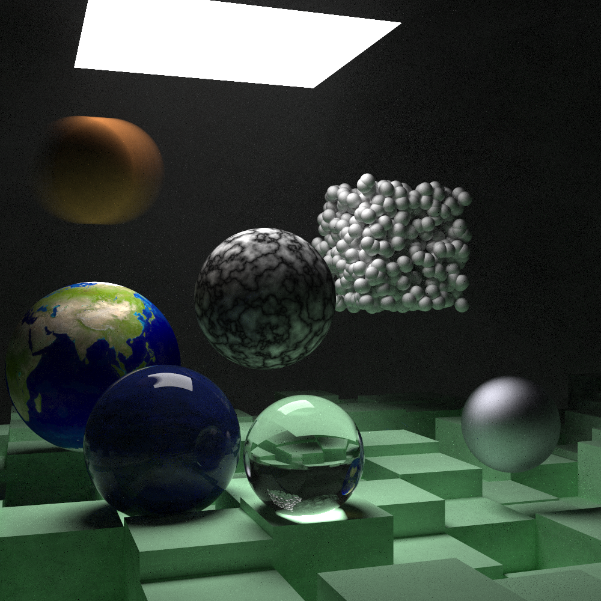

# Ray Tracing: the Next Week in Futhark

This is a port of [Ray Tracing: the Next
Week](https://www.realtimerendering.com/raytracing/Ray%20Tracing_%20The%20Next%20Week.pdf)
to the purely functional data-parallel language
[Futhark](https://futhark-lang.org), which can generate efficient GPU
code.  See also the Futhark implementation of [Ray Tracing in One
Weekend](https://github.com/athas/raytracinginoneweekendinfuthark).

The scene below took about 7 minutes to render on an AMD Vega 64 GPU,
and is 1000x1000 pixels, with 5000 samples per pixel, and a maximum of
50 reflections per ray.



## Details

This ray tracer was substantially more difficult to implement than the
[weekend
version](https://github.com/athas/raytracinginoneweekendinfuthark) it
is based on, and the problems mentioned there still apply.  I
encountered the following new problems.

### Constructing a Bounding Volume Hierarchy (BVH)

Steve Hollasch's C++ implementation uses a simple and elegant
recursive divide-and-conquer technique for constructing the BVH.
Futhark does not support recursion, so I really dreaded implementing
this.  Fortunately, Tero Karras has written a wonderful paper titled
[Maximizing Parallelism in the Construction of BVHs, Octrees, and
*k*-d
Trees](https://research.nvidia.com/sites/default/files/publications/karras2012hpg_paper.pdf)
which presents an elegant data-parallel algorithm for constructing
radix trees.  My [Futhark
implementation](https://github.com/athas/raytracingthenextweekinfuthark/blob/master/radixtree.fut)
is quite simple and runs fast, and it is straightforward to [build the
BVH on top of
that](https://github.com/athas/raytracingthenextweekinfuthark/blob/master/bvh.fut).
In the end, BVH construction ends up taking less than 0.02% of the
total runtime, makes the run time *O(log(n))* rather than *O(n)* in
the number of objects.

One significant difference is that my implementation constructs the
BVH for the *entire* scene, whereas the C++ implementation permits a
kind of manual decomposition as well.  I think the latter may be
better for irregular scenes, like the demo image above, where the BVH
is only really useful for the floor and the cube made of spheres.

### Recursive types

In the C++ implementation, certain objects are expressed recursively.
For example, the "tiled" texture, where the even/odd tiles are their
own texture objects.  In my implementation, the even/odd tiles must
simply be flat colours.  Also, "mediums" (fog) is hacked in as a kind
of special flag on objects.  The whole idea of formulating fog as a
surface seems to be a hack in the first place, so I don't feel too bad
about it.  One resulting limitation is that fog only works well in the
form of spheres.

The biggest limitation is that I do not support *aggregate objects*.
In the C++ implementation, operations such as translation and rotation
can be applied to an entire collection of objects.  In my Futhark
implementation, all objects are primitives (spheres or rectangles),
and transformations can only be applied to each object in isolation.
I am pretty sure that this means rotation does not work correctly (the
sphere-cube in the image above looks incorrectly positioned compared
to reference images).  I think this can be fixed by someone who has a
better grasp of 3D geometry than I have.

### Images

The C++ implementation permits objects to be textured with an image
loaded from disk, like the Earth sphere in the image above.  Since
Futhark does not permit file IO, I support this via a hack.  I permit
a *single* image texture (although it can be used on different
objects) that is piped in as input when the program is run.  The
example texture is stored in the repository in the file
`earthmap.data` using the [Futhark binary data
format](https://futhark.readthedocs.io/en/latest/binary-data-format.html)
(essentially the raw bytes prefixed with size information).  In
principle this could be extended to multiple images using some kind of
packing technique.

An [otherwise very good Rust
implementation](https://github.com/cbiffle/rtiow-rust) does not
implement image textures at all, so I feel like I'm in good company!

### Fewer primitives

The C++ implementation defines three classes of rectangles, one for
each pair of axes (x/y, x/z, y/z).  I did not want to do this, because
each of them is almost identical to the other, and branching too much
[can be harmful for SIMD
performance](https://cvw.cac.cornell.edu/gpu/thread_div).  Instead, I
use a single `rect` type with a tag indicating to which axes it is
aligned.

### Register pressure

I found that GPU performance was severely limited because the
generated code was using too many scalars.  This limits the number of
threads that can run concurrently on the GPU (or alternatively,
requires expensive spills to global memory).  The main culprit was
iterating the BVH looking for the best hit, where I kept a full hit
record as a loop variant value (including `material`, a large type).
This is because Futhark does not support references or pointers, but
is fully pass-by-value.  I changed the BVH iteration to only keep
track of the *index* of the closest object found so far, and re-run
the hit calculation with the final object at the end, which made the
run time drop by a factor of two.

## Running

You will need Futhark 0.12.2 or newer to run this code.  You will also
need
[data2png.py](https://github.com/diku-dk/futhark/blob/master/tools/data2png.py),
which turns Futhark values into PNG images.  Once these are available,
run:

```
$ futhark pkg sync
$ futhark opencl raytracer.fut
$ (echo 1000 1000 5000; cat earthmap.data) | ./raytracer -b | python ~/repos/futhark/tools/data2png.py /dev/stdin scene.png
```
